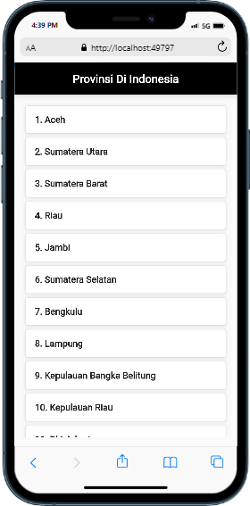

<h1 align="center">Tugas UAS Pemrograman Mobile 2</h1>

 Aplikasi Flutter untuk Daftar Provinsi Indonesia menggunakan API.

<h2 align="center">Petunjuk Instalasi</h2>

<ol >
  <li>Download dan instal Aplikasi Flutter dari <a href="https://docs.flutter.dev/getstarted/install">flutter.dev</a>.</li>
  <li>Setelah instalasi selesai, simpan Flutter di Local Disk (F:).</li>
  <li>Buka command prompt dan ketik <code>flutter</code> untuk memastikan Flutter terhubung dengan baik.</li>
  <li>Jika belum terhubung, tambahkan Flutter ke Path sistem:
    <ul>
      <li>Buka "Edit Environment Variable" pada pencarian Windows.</li>
      <li>Tambahkan <code>F:\flutter\bin</code> ke Path baru.</li>
    </ul>
  </li>
</ol>

<h2 align="center">Instalasi Flutter di Visual Studio Code</h2>

<ol >
  <li>Buka Visual Studio Code dan klik Extensions (Ctrl + Shift + X).</li>
  <li>Cari extension Flutter.</li>
  <li>Klik Download untuk menginstal extension Flutter.</li>
</ol>

<h2 align="center">Membuat Proyek Flutter</h2>

<ol >
  <li>Buat folder baru untuk proyek Flutter.</li>
  <li>Buka terminal atau command prompt, lalu masuk ke direktori proyek yang telah dibuat menggunakan perintah <code>cd <nama_folder_proyek></code>.</li>
  <li>Jalankan perintah <code>flutter create nama_proyek</code> untuk membuat proyek Flutter baru. Ganti <code>nama_proyek</code> dengan nama yang sesuai untuk proyek Anda.</li>
  <li>Alternatifnya, Anda dapat menggunakan Command Palette (Ctrl + Shift + P), ketik "Flutter New Project", dan tentukan direktori proyek.</li>
</ol>

<h2 align="center">Menggunakan API untuk Daftar Provinsi Indonesia</h2>

<ol >
  <li>Buka file <code>main.dart</code> yang terdapat di dalam folder <code>lib</code> pada proyek Flutter.</li>
  <li>Gantikan isi file <code>main.dart</code> dengan kode yang disediakan.</li>
  <li>Pastikan Anda sudah menambahkan dependensi <code>http</code> pada file <code>pubspec.yaml</code>:
    <ul>
      <li>Tambahkan <code>http: ^0.13.3</code> di bawah <code>dependencies</code>.</li>
    </ul>
  </li>
  <li>Simpan file <code>pubspec.yaml</code>.</li>
  <li>Jalankan perintah <code>flutter pub get</code> untuk menginstal dependensi baru.</li>
  <li>Jalankan perintah <code>flutter run</code> untuk menjalankan aplikasi Flutter.</li>
  <li>Lihat hasil aplikasi pada perangkat atau emulator yang terhubung.</li>
</ol>

<h2 align="center">Contoh Hasil Run Aplikasi</h2>

  

<h2 align="center">Terima kasih.</h2>
